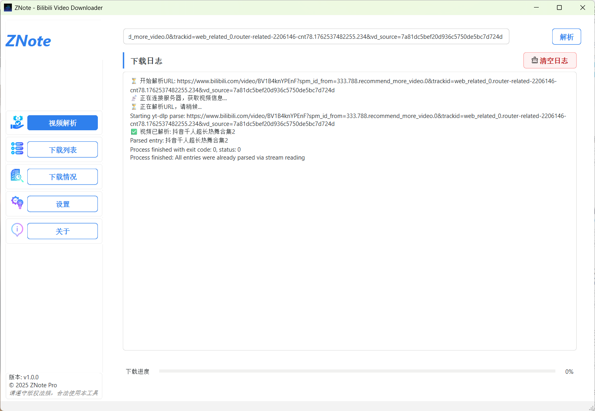
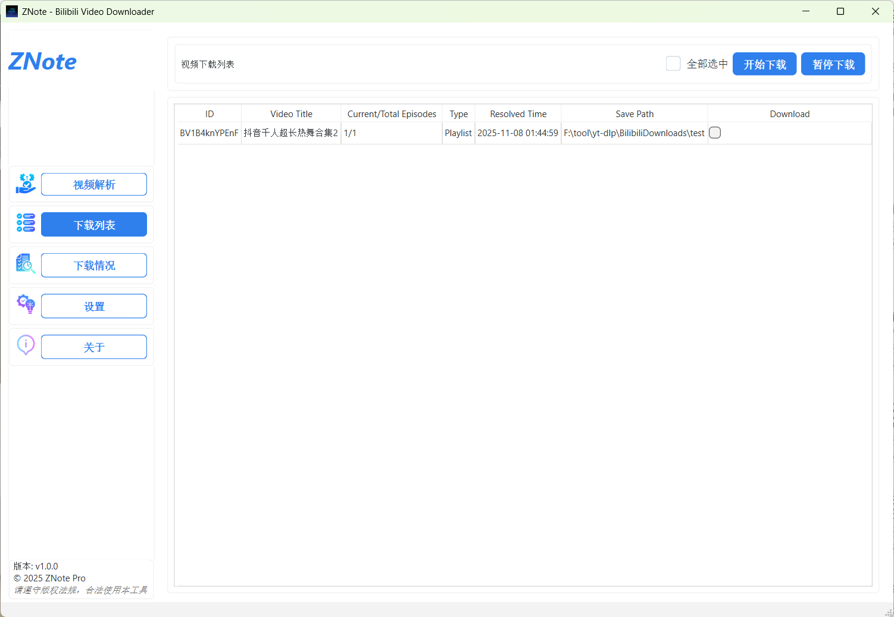

# ZNote - Bilibili 视频下载器

[](https://opensource.org/licenses/MIT)
[](https://www.qt.io/)
[](https://isocpp.org/)

[English](README.md) | [中文](README_zh.md)

一个现代化的跨平台桌面应用程序，用于从 Bilibili 和其他平台下载视频，基于 yt-dlp 构建。使用 Qt6 和 C++17 开发。

## 🖼️ 程序界面

### 主界面 - 视频解析


ZNote 提供简洁直观的用户界面，左侧导航栏包含五个主要功能模块。主界面支持直接输入 Bilibili 视频 URL 进行解析，实时显示解析日志和进度信息。

### 下载列表


下载列表页面展示所有已解析的视频信息，包括视频 ID、标题、集数、类型、解析时间和保存路径。支持批量选择和下载管理，可以方便地控制下载任务。

### 设置页面


设置页面提供丰富的配置选项，包括：
- **基础下载配置**：默认保存路径、下载线程数
- **文件命名规则**：自定义文件前缀/后缀
- **下载完成操作**：提示音、自动打开目录等

## ✨ 功能特性

- 🎬 **多平台支持**: 支持从 Bilibili 和其他 yt-dlp 支持的平台下载视频
- 📥 **批量下载**: 支持同时下载多个视频或整个播放列表
- 🎯 **智能队列管理**: 支持并发下载的智能任务队列
- 📊 **下载历史**: 详细记录所有下载历史
- 🎨 **现代化界面**: 美观、响应式的界面，支持浅色/深色主题
- ⚙️ **可自定义设置**: 配置下载路径、文件命名、线程数等
- 🔊 **通知提醒**: 下载完成时播放提示音
- 📁 **自动打开目录**: 下载完成后自动打开下载目录
- 💾 **持久化存储**: 基于 JSON 的配置和历史记录存储

## 📋 系统要求

- **Qt 6.9.1** 或更高版本 (Core, Gui, Widgets, Multimedia)
- **CMake 3.24** 或更高版本
- **C++17** 兼容的编译器
- **yt-dlp** (自动检测或可放置在应用程序目录)

### 平台支持

- ✅ Windows (已在 Windows 10/11 测试)
- ✅ Linux (应支持 Qt6)
- ✅ macOS (应支持 Qt6)

## 🚀 安装

### 从源码构建

1. **克隆仓库**
   ```bash
   git clone https://github.com/1716285375/ZNote.git
   cd ZNote
   ```

2. **安装 Qt6**
   - 从 [qt.io](https://www.qt.io/download) 下载并安装 Qt6
   - 确保 Qt6 在 PATH 中或设置 `CMAKE_PREFIX_PATH`

3. **配置和构建**
   ```bash
   # 使用 CMake presets (推荐)
   cmake --preset Qt-Debug
   cmake --build out/build/debug
   
   # 或手动配置
   mkdir build && cd build
   cmake ..
   cmake --build .
   ```

4. **安装 yt-dlp** (如果不在 PATH 中)
   - 从 [yt-dlp 发布页面](https://github.com/yt-dlp/yt-dlp/releases) 下载
   - 将 `yt-dlp.exe` (Windows) 或 `yt-dlp` (Linux/macOS) 放置在应用程序目录

### Windows 快速开始

1. 从 [发布页面](https://github.com/1716285375/ZNote/releases) 下载最新版本
2. 解压并运行 `ZNote.exe`
3. 将 `yt-dlp.exe` 放置在可执行文件同一目录

## 📖 使用指南

### 基本使用

1. **启动应用程序**
2. **输入视频 URL** 在输入框中（支持 Bilibili 视频 URL 和播放列表）
3. **点击"解析"** 分析视频信息
4. **选择要下载的视频** 从列表中选择
5. **配置下载设置**:
   - 设置下载目录
   - 选择文件前缀/后缀
   - 设置线程数 (1-10)
6. **点击"下载"** 开始下载

### 配置说明

应用程序使用 `config.json` 进行配置。首次运行时会创建默认配置。

**示例 `config.json`:**
```json
{
  "download": {
    "defaultPath": "C:/Downloads/Bilibili",
    "threadCount": 4,
    "filePrefix": "ZN_",
    "fileSuffix": "_video",
    "onComplete": {
      "playSound": true,
      "autoOpenDir": false
    }
  }
}
```

### 设置选项

- **默认路径**: 默认下载目录
- **线程数**: 并发下载数量 (1-10)
- **文件前缀/后缀**: 自定义下载文件名
- **播放提示音**: 下载完成时启用声音通知
- **自动打开目录**: 下载完成后自动打开下载文件夹

## 📁 项目结构

```
ZNote/
├── ZNote/              # 主项目目录
│   ├── assets/        # 资源文件 (图标、样式、声音)
│   ├── include/       # 头文件
│   │   ├── app/      # 应用程序核心
│   │   ├── component/ # UI 组件
│   │   ├── core/     # 核心功能
│   │   ├── services/ # 服务层
│   │   ├── ui/       # UI 类
│   │   └── utils/    # 工具函数
│   ├── src/          # 源文件
│   ├── tests/        # 测试文件
│   ├── CMakeLists.txt # CMake 配置
│   └── resources.qrc # Qt 资源文件
├── CMakeLists.txt     # 根 CMake 配置
└── README.md          # 本文档
```

## 🛠️ 开发

### 构建

```bash
# Debug 构建
cmake --preset Qt-Debug
cmake --build out/build/debug

# Release 构建
cmake --preset Qt-Release  # (如果已配置)
cmake --build out/build/release
```

### 代码风格

- 遵循 Qt 编码规范
- 使用有意义的变量和函数名
- 为复杂逻辑添加注释
- 保持函数简洁专注

### 架构说明

应用程序采用分层架构：

- **UI 层**: Qt 组件和模型
- **服务层**: 业务逻辑 (DownloadService, ConfigService, HistoryService)
- **核心层**: 核心功能 (URL 解析、视频下载)
- **工具层**: 工具函数和辅助类

## 🤝 贡献

欢迎贡献！请阅读 [ZNote/CONTRIBUTING_zh.md](ZNote/CONTRIBUTING_zh.md) 了解贡献指南和提交 Pull Request 的流程。

## 📝 许可证

本项目采用 MIT 许可证 - 查看 [ZNote/LICENSE](ZNote/LICENSE) 文件了解详情。

## 🙏 致谢

- [yt-dlp](https://github.com/yt-dlp/yt-dlp) - 强大的视频下载工具
- [Qt](https://www.qt.io/) - 跨平台框架
- [Bilibili](https://www.bilibili.com/) - 视频平台

## 📧 联系方式

- **问题反馈**: [GitHub Issues](https://github.com/1716285375/ZNote/issues)
- **讨论**: [GitHub Discussions](https://github.com/1716285375/ZNote/discussions)
- **QQ 交流群**: ZNote 开源项目群 (群号: 491086094)

## 📅 更新日志

### 版本 1.0.0
- ✨ 首次发布
- 🎬 多平台视频下载支持
- 📊 下载历史管理
- 🎨 现代化 UI 和主题支持
- ⚙️ 完整的设置系统
- 🔊 声音通知
- 📁 自动打开目录功能

---

**注意**: 本项目仅供学习使用。请遵守视频平台的服务条款和版权法律。

